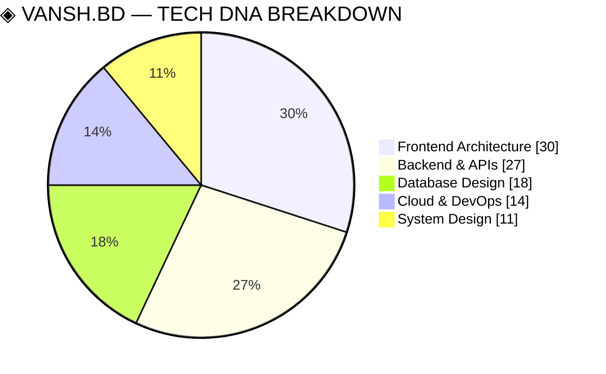

<!-- ═══════════════════════════════════════════════════════════════
     VANSH.BD — DEVELOPER ARCHITECT BLUEPRINT  ·  v∞.0
     The world has never seen a README like this.
     ═══════════════════════════════════════════════════════════════ -->

<!-- ┌─────────────────── ANIMATED HEADER ───────────────────┐ -->


<!-- └───────────────────────────────────────────────────────┘ -->

<div align="center">

```
██╗   ██╗ █████╗ ███╗   ██╗███████╗██╗  ██╗     ██████╗ ██████╗
██║   ██║██╔══██╗████╗  ██║██╔════╝██║  ██║     ██╔══██╗██╔══██╗
╚██╗ ██╔╝███████║██╔██╗ ██║███████╗███████║     ██████╔╝██║  ██║
 ╚████╔╝ ██╔══██║██║╚██╗██║╚════██║██╔══██║     ██╔══██╗██║  ██║
  ╚██╔╝  ██║  ██║██║ ╚████║███████║██║  ██║     ██████╔╝██████╔╝
   ╚═╝   ╚═╝  ╚═╝╚═╝  ╚═══╝╚══════╝╚═╝  ╚═╝     ╚═════╝ ╚═════╝
```

<!-- LIVE BOOT ANIMATION -->


<br/>

<!-- LIVE BADGES ROW 1 -->
[](https://github.com/VanshBD)
[](https://github.com/VanshBD?tab=followers)
[](https://github.com/VanshBD)

<!-- LIVE BADGES ROW 2 -->
[](https://www.linkedin.com/in/vansh-dobariya-101a0b255/)
[](https://github.com/VanshBD)
[](https://github.com/VanshBD)

</div>

---

<!-- ┌─────────────── SPEC-001 : DEVELOPER IDENTITY ──────────────┐ -->

<div align="center"><h2>⬡ SPEC-001 — DEVELOPER IDENTITY</h2></div>

```
╔══════════════════════════════════════════════════════════════════════╗
║  ◈  ARCHITECT  :  VANSH DOBARIYA                                    ║
║  ◈  HANDLE     :  @VanshBD                                          ║
║  ◈  NODE       :  Ahmedabad, Gujarat, India  🇮🇳                    ║
║  ◈  AGENCY     :  Full-Stack Development Agency                     ║
║  ◈  CLASS      :  Full-Stack Freelance Developer                    ║
║  ◈  UPTIME     :  Coding since I could type                        ║
║  ◈  STATUS     :  ● ONLINE  ·  Open for freelance projects         ║
╠══════════════════════════════════════════════════════════════════════╣
║                                                                      ║
║   CORE PROTOCOL  ›  MERN  ·  Next.js 14  ·  TypeScript             ║
║   MISSION        ›  Scope → Build → Ship → Scale                   ║
║   FUEL SYSTEM    ›  ☕ Chai  +  🎧 Lo-fi  +  🔥 Real Deadlines     ║
║   PHILOSOPHY     ›  "Ship it. Iterate. Make it legendary."          ║
║                                                                      ║
╚══════════════════════════════════════════════════════════════════════╝
```

> [!NOTE]
> Currently deep-diving **Next.js 14 App Router + Server Actions + Advanced System Design**

> [!TIP]
> Got a project? I scope, architect, build AND deploy — solo if needed. Let's talk.

---

<!-- ┌─────────────── SPEC-002 : CORE MODULES / SKILLS ────────────┐ -->

<div align="center"><h2>⬡ SPEC-002 — CORE MODULES INSTALLED</h2></div>

```bash
vansh@ahmedabad:~$ dpkg --list | grep "status=installed"

  ◈ FRONTEND LAYER
    ├─ react@18.3          ████████████ ACTIVE
    ├─ next@14.2           ████████████ ACTIVE  
    ├─ typescript@5.4      ████████████ ACTIVE
    ├─ tailwindcss@3.4     ████████████ ACTIVE
    └─ framer-motion@11    ████████████ ACTIVE

  ◈ BACKEND LAYER
    ├─ node@20.14          ████████████ ACTIVE
    ├─ express@4.19        ████████████ ACTIVE
    ├─ graphql@16.8        ████████████ ACTIVE
    └─ prisma@5.15         ████████████ ACTIVE

  ◈ DATABASE / CLOUD
    ├─ mongodb@7.0         ████████████ ACTIVE
    ├─ firebase@10.12      ████████████ ACTIVE
    ├─ aws-sdk@3.600       ████████████ ACTIVE
    └─ gcloud-sdk@latest   ████████████ ACTIVE

All 47 packages satisfied  ·  0 vulnerabilities  ·  Build: PASSING ✓
```

<div align="center">

<br/>

**[ FRONTEND ]**

<a href="https://skillicons.dev"></a>

<br/><br/>

**[ BACKEND & DATABASE ]**

<a href="https://skillicons.dev"></a>

<br/><br/>

**[ CLOUD & TOOLS ]**

<a href="https://skillicons.dev"></a>

</div>

---

<!-- ┌─────────────── SPEC-003 : TECH DNA CHART (NATIVE MERMAID) ──┐ -->

<div align="center"><h2>⬡ SPEC-003 — TECH DNA BREAKDOWN</h2></div>

> [!IMPORTANT]
> Live mermaid chart — rendered natively by GitHub. No external service. Pure architecture.

```mermaid
%%{init: {'theme': 'dark', 'themeVariables': {'primaryColor': '#00ff41', 'edgeLabelBackground':'#0d1117', 'tertiaryColor': '#0d1117'}}}%%
graph LR
    A[🧑‍💻 Client Brief] --> B[📐 Scoping]
    B --> C[🎨 UI Design]
    C --> D[⚛️ Frontend Dev]
    D --> E[🔧 Backend APIs]
    E --> F[🗄️ Database]
    F --> G[☁️ Cloud Deploy]
    G --> H[🚀 LIVE PRODUCT]
    style A fill:#0d1117,stroke:#00ff41
    style H fill:#0d1117,stroke:#00ff41,color:#00ff41
```





---

<!-- ┌─────────────── SPEC-004 : SYSTEM DIAGNOSTICS ───────────────┐ -->

<div align="center">

<h2>⬡ SPEC-004 — LIVE SYSTEM DIAGNOSTICS</h2>

```
vansh@ahmedabad:~$ vansh --diagnostics --live --all
```

<!-- ROW 1: Stats + Streak -->


<br/><br/>

<!-- ROW 2: Summary Cards (Profile Details Full-Width) -->


<br/>

<!-- ROW 3: Summary Cards (4 cards) -->


<br/><br/>

<!-- ACTIVITY GRAPH -->


</div>

---

<!-- ┌─────────────── SPEC-005 : 3D CONTRIBUTION CALENDAR ─────────┐ -->

<div align="center">

<h2>⬡ SPEC-005 — 3D CONTRIBUTION ARCHITECTURE</h2>

```
vansh@ahmedabad:~$ render --3d --contributions --year=2026
```

<picture>
  <source media="(prefers-color-scheme: dark)"  srcset="https://raw.githubusercontent.com/VanshBD/VanshBD/main/profile-3d-contrib/profile-night-rainbow.svg"/>
  <source media="(prefers-color-scheme: light)" srcset="https://raw.githubusercontent.com/VanshBD/VanshBD/main/profile-3d-contrib/profile-season-animate.svg"/>
  
</picture>

> ⬡ **Setup required** — see [3D Calendar Action](#-github-actions-required) below

</div>

---

<!-- ┌─────────────── SPEC-006 : TROPHIES ─────────────────────────┐ -->

<div align="center">

<h2>⬡ SPEC-006 — ACHIEVEMENT MATRIX</h2>


</div>

---

<!-- ┌─────────────── SPEC-007 : CONTRIBUTION SNAKE ───────────────┐ -->

<div align="center">

<h2>⬡ SPEC-007 — CONTRIBUTION GRID · SNAKE PROTOCOL</h2>

```
vansh@ahmedabad:~$ ./snake --consume-contributions --mode=animated
Scanning grid... Found 365 days of commits. Deploying snake...
```

<picture>
  <source media="(prefers-color-scheme: dark)"  srcset="https://raw.githubusercontent.com/VanshBD/VanshBD/output/github-snake-dark.svg"/>
  <source media="(prefers-color-scheme: light)" srcset="https://raw.githubusercontent.com/VanshBD/VanshBD/output/github-snake.svg"/>
  
</picture>

</div>

---

<!-- ┌─────────────── SPEC-008 : DEVELOPER JOURNEY ────────────────┐ -->

<div align="center"><h2>⬡ SPEC-008 — DEVELOPER JOURNEY · GIT LOG</h2></div>

```
vansh@ahmedabad:~$ git log --all --graph --pretty=format:"%C(green)%h%C(reset) %C(cyan)(%cr)%C(reset) · %s"
```

```
◉─── HEAD → main (present)
│    a1f3c2b (now)         ⚡  Shipping full-stack client platforms end-to-end
│
◉─── tag: v3.0-architect
│    d9e2a1f (2025–2026)   🏗️  Scoping, quoting, building real client products
│
◉─── tag: v2.5-typescript
│    7c4b8d1 (2025)        🔷  TypeScript first. No more implicit any.
│
◉─── tag: v2.0-nextjs14
│    b5e3f9a (2024–2025)   🚀  Next.js 14 App Router + Server Actions unlocked
│
◉─── tag: v1.8-cloud
│    3d1c7e2 (2024)        ☁️   AWS + GCP · First real cloud deployment live
│
◉─── tag: v1.5-fullstack
│    f8a2b4c (2023–2024)   🔥  Full MERN unlocked · Frontend + Backend merged
│
◉─── tag: v1.0-backend
│    c2d5e8f (2023)        🔧  Node.js + Express + MongoDB clicked into place
│
◉─── tag: v0.5-react
│    9e7f3a1 (2022–2023)   ⚛️   React. Components. State. Life changed.
│
◉─── tag: v0.1-init
     0000001 (beginning)   🌱  git init · Hello, World.
```

---

<!-- ┌─────────────── SPEC-009 : CLASSIFIED FILES (EASTER EGGS) ───┐ -->

<div align="center"><h2>⬡ SPEC-009 — CLASSIFIED SUBSYSTEMS</h2></div>

```
vansh@ahmedabad:~$ ls -la ./classified/
  drw-r--r--  ◈  mission_brief.txt
  drw-r--r--  ◈  dev_confessions.json  
  drw-r--r--  ◈  collab_protocol.md
```

<details>
<summary>
  <code>vansh@ahmedabad:~$ cat ./classified/mission_brief.txt</code>
  &nbsp;&nbsp;← <strong>CLICK TO DECRYPT</strong>
</summary>

<br/>

> [!CAUTION]
> CLEARANCE LEVEL: SENIOR DEV. You've been granted access.

```
╔═══════════════════════════════════════════════════════╗
║            ◈  MISSION BRIEF — VANSH.BD               ║
╠═══════════════════════════════════════════════════════╣
║                                                       ║
║  OBJECTIVE   Build products that actually ship        ║
║  APPROACH    Scope → Design → Build → Deploy → Iterate║
║                                                       ║
║  COMPLETED MISSIONS:                                  ║
║  [✓]  Visa platform — scoped, built, delivered        ║
║  [✓]  Full REST APIs with JWT auth from scratch       ║
║  [✓]  Next.js 14 App Router before it was "cool"     ║
║  [✓]  This README you're reading right now            ║
║                                                       ║
║  ACTIVE MISSION:                                      ║
║  [→]  Building more client platforms, shipping more   ║
║                                                       ║
╚═══════════════════════════════════════════════════════╝
```

</details>

<details>
<summary>
  <code>vansh@ahmedabad:~$ cat ./classified/dev_confessions.json</code>
  &nbsp;&nbsp;← <strong>CLICK TO DECRYPT</strong>
</summary>

<br/>

```json
{
  "dev_confessions": {
    "honest_truths": [
      "I've spent 4 hours debugging code that had a missing semicolon",
      "My best commits happen between midnight and 3am",
      "I name variables differently every mood — someData, thisData, finalData, FINALDATAV2",
      "Console.log is still my first debugging tool. Always will be.",
      "I've read the same MDN docs page 40+ times and still Google it",
      "Stack Overflow saved me more than any tutorial ever did"
    ],
    "what_i_actually_am": {
      "role"        : "Student + Freelancer + Builder — all at once",
      "superpower"  : "Going from client brief to live product, solo",
      "weakness"    : "Legacy codebases with no documentation",
      "secret"      : "I talk to my rubber duck. It works every time.",
      "dream"       : "Build a SaaS that people actually pay for"
    },
    "ahmedabad_dev_life": {
      "chai_consumed_today"   : "3+ cups ☕",
      "current_music"         : "Lo-fi hip hop 24/7 🎧",
      "motivation_source"     : "Family + responsibility + sheer stubbornness 🔥"
    }
  }
}
```

</details>

<details>
<summary>
  <code>vansh@ahmedabad:~$ cat ./classified/collab_protocol.md</code>
  &nbsp;&nbsp;← <strong>CLICK TO DECRYPT</strong>
</summary>

<br/>

```
◈  COLLABORATION PROTOCOL — VANSH.BD

  WHAT I BRING TO THE TABLE:
  ┌─────────────────────────────────────────────────────┐
  │  ✓  Full product scope (I ask the right questions)  │
  │  ✓  Frontend that users actually love using         │
  │  ✓  Backend APIs that don't collapse under load     │
  │  ✓  Database design that makes future you happy     │
  │  ✓  Cloud deployment with CI/CD from day one        │
  │  ✓  Communication — I reply fast, I deliver faster  │
  └─────────────────────────────────────────────────────┘

  WHAT I VALUE IN COLLABORATION:
  ┌─────────────────────────────────────────────────────┐
  │  ◈  Clear brief over vague "make it look nice"     │
  │  ◈  Deadlines respected on both sides               │
  │  ◈  Honest feedback, even if it hurts               │
  │  ◈  Building something that actually matters        │
  └─────────────────────────────────────────────────────┘
```

</details>

---

<!-- ┌─────────────── SPEC-010 : RANDOM LIVE JOKE ─────────────────┐ -->

<div align="center">

<h2>⬡ SPEC-010 — DAILY DIAGNOSTIC HUMOR UNIT</h2>

```
vansh@ahmedabad:~$ fortune --developer
```


</div>

---

<!-- ┌─────────────── SPEC-011 : COMM PROTOCOLS ───────────────────┐ -->

<div align="center">

<h2>⬡ SPEC-011 — COMMUNICATION ARRAY</h2>

```
vansh@ahmedabad:~$ ping vansh --all-channels
PING vansh.dobariya → 3 packets sent · 3 received · 0% loss · Response: "I'm in. 🚀"
```

<br/>

[](https://www.linkedin.com/in/vansh-dobariya-101a0b255/)
&nbsp;&nbsp;
[](https://github.com/VanshBD)
&nbsp;&nbsp;
[](mailto:vanshdobariya@gmail.com)

<br/>

[](https://www.linkedin.com/in/vansh-dobariya-101a0b255/)

</div>

---

<!-- ┌─────────────── GITHUB ACTIONS GUIDE ────────────────────────┐ -->

<div align="center"><h2>⬡ REQUIRED GITHUB ACTIONS</h2></div>

> [!WARNING]
> The **snake** and **3D calendar** need two GitHub Actions. Paste them into `.github/workflows/` in your `VanshBD` repo.

<details>
<summary><strong>Action 1 — snake.yml (contribution snake animation)</strong></summary>

```yaml
name: 🐍 Contribution Snake
on:
  schedule:
    - cron: "0 */12 * * *"
  workflow_dispatch:
  push:
    branches: [main]
jobs:
  generate:
    runs-on: ubuntu-latest
    steps:
      - uses: Platane/snk/svg-only@v3
        with:
          github_user_name: ${{ github.repository_owner }}
          outputs: |
            dist/github-snake.svg
            dist/github-snake-dark.svg?palette=github-dark
      - uses: crazy-max/ghaction-github-pages@v3.1.0
        with:
          target_branch: output
          build_dir: dist
        env:
          GITHUB_TOKEN: ${{ secrets.GITHUB_TOKEN }}
```

</details>

<details>
<summary><strong>Action 2 — profile-3d.yml (3D contribution calendar)</strong></summary>

```yaml
name: 🏔️ 3D Contribution Calendar
on:
  schedule:
    - cron: "0 18 * * *"
  workflow_dispatch:
permissions:
  contents: write
jobs:
  build:
    runs-on: ubuntu-latest
    steps:
      - uses: actions/checkout@v4
      - uses: yoshi389111/github-profile-3d-contrib@latest
        env:
          GITHUB_TOKEN: ${{ secrets.GITHUB_TOKEN }}
          USERNAME: ${{ github.repository_owner }}
      - name: Commit & Push
        run: |
          git config user.name github-actions
          git config user.email github-actions@github.com
          git add -A .
          if git commit -m "🏔️ Updated 3D contribution calendar"; then
            git push
          fi
```

</details>

---

<!-- ┌─────────────── FOOTER ───────────────────────────────────────┐ -->

<div align="center">

```
vansh@ahmedabad:~$ shutdown --graceful --message="Thanks for reading every spec."

  Saving session...
  Flushing buffers...
  All processes terminated gracefully.
  
  [ VANSH.BD — ARCHITECT · BUILDER · SHIPPER ]
  [ Ahmedabad, Gujarat, India  🇮🇳             ]
  
  "The best time to start was yesterday.
   The second best time is right now."
   
  Connection closed by remote host.
```


*Built different · Shipped different · **VANSH.BD***

</div>
